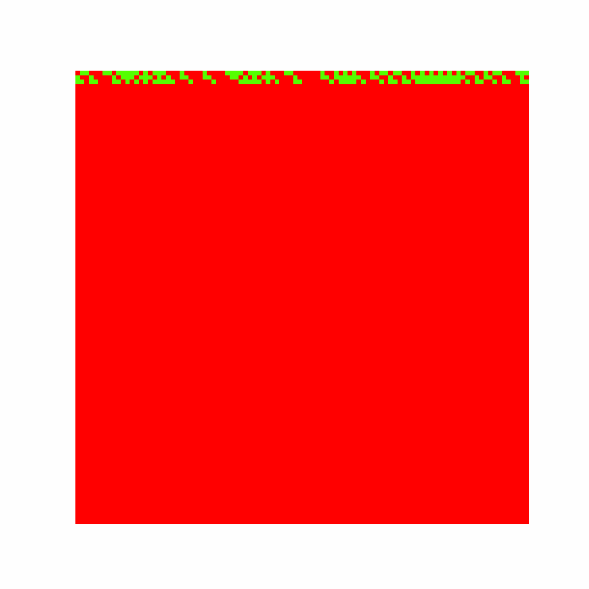

# Cellular_automaton_generator_flask_application

[Intro]
The code is a Flask web application that generates and displays a cellular automaton animation based on user-defined inputs. The application uses the numpy and matplotlib libraries to generate the animation and Flask to serve the web page. The animation is based on a one-dimensional binary cellular automaton, where each cell is updated according to its neighbors and an update rule specified by the user. The application takes input from the user for the update rule, initial condition, impulse position, and other parameters. The application generates an animation of the cellular automaton and displays it on the web page along with other images.

[General]
- The code imports necessary libraries such as time, random, warnings, os, numpy, matplotlib, flask, and shutil.
- The Flask application is initialized with the name app.
- A path to a folder with GIF images is set.
- The index() function is defined for the main page of the application that displays a GIF image and returns a rendered HTML template.
- The Generator() function is defined that accepts user input for initializing the cellular automata, processes the input, generates the automata, and returns a rendered HTML template that displays an animation of the generated cellular automata.
- The if __name__ == '__main__': block starts the Flask application and runs it on a local server.
- The program is able to generate animations for cellular automata defined by a rule number, size, time steps, initial conditions, and the position of the initial impulse. The generated animations are displayed on a webpage using Flask.

[Process]

The program then processes the contents of the input file, which consists of several lines, each containing a single integer. The program reads each integer, computes its factorial using a recursive function, and then writes the result to an output file named output.txt.

The program uses the built-in open() function to open the input and output files in read and write modes, respectively. It then uses a for loop to iterate over each line in the input file, stripping any leading or trailing whitespace and converting the line to an integer using the int() function.

The program then calls a recursive function named factorial() with the integer as an argument, and stores the result in a variable named result. The factorial() function uses a recursive algorithm to compute the factorial of its input argument, and returns the result to the calling code.

Finally, the program writes the result to the output file using the write() method, converting the result to a string using the str() function and appending a newline character to the end of each line.

Once the loop has processed all lines in the input file, the program closes both files using the close() method, and exits.

[Output]

[

